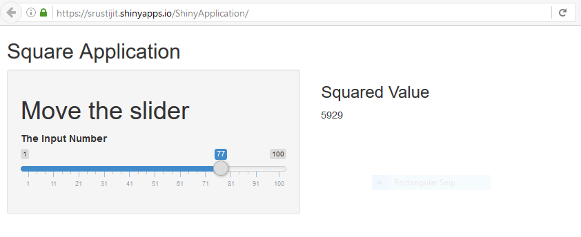

```{r setup, include=FALSE}
knitr::opts_chunk$set(echo = FALSE)
```

## Overview

This application is developed as part of the "Shiny Application and Reproducible Pitch" assignment.

The Shiny application developed for the first part of the assignment can be accessed from the below link: 
https://srustijit.shinyapps.io/ShinyApplication/

Source code files(ui.R and server.R) can be accessed from the below gitHub repo: https://github.com/srustijit/Shiny-Application-and-Reproducible-Pitch


## Shiny Application

This Shiny App can be used to find the square of a natural number between 1 and 100, both inclusive.

The input is in the form of a slider. The output displays the square of the corresponding input number.


## Screenshot of the App



## Documentaion

The application can be accessed online on RStudio's Shinyapp Server (recommended) or it can be downloaded from github and run on the user's computer.

Download the below files from GitHub

* ui.R
* server.R

Install the shiny library using the below command:
 
 install.packages("shiny")
 
Create a new directory and place the three files there. Open all files in your R IDE and enter the following lines on your R console.

library(shiny) 
runApp()